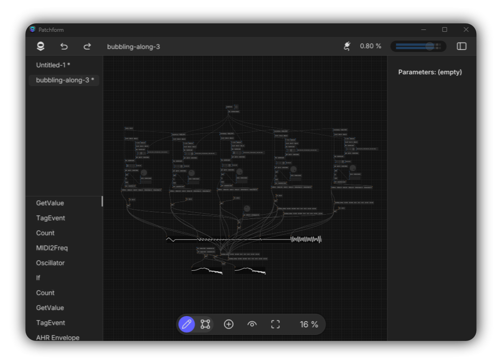
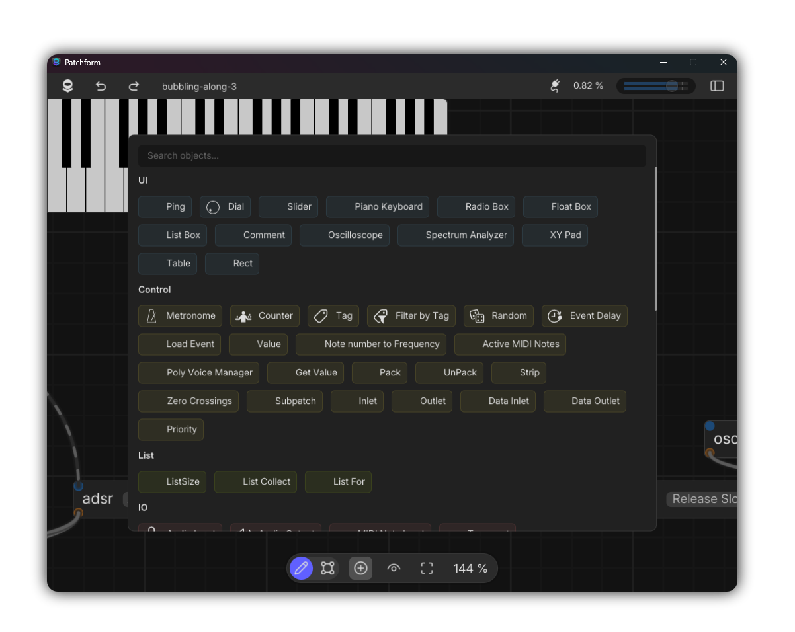

<section class="hero">
  

    <h1>Patchform</h1>
    
Modular audio plugin creation environment

    

      
      
    

  

    
</section>

<section class="about-objects">
  

    

      
Build with modular nodes and connect them visually.

    

    

      
    

  

</section>

<section id="features">
  <h2>Comming 2026</h2>
  
Patchform is currently in heavy developement, join my Patreon, or Discord channel for updates…

</section>
